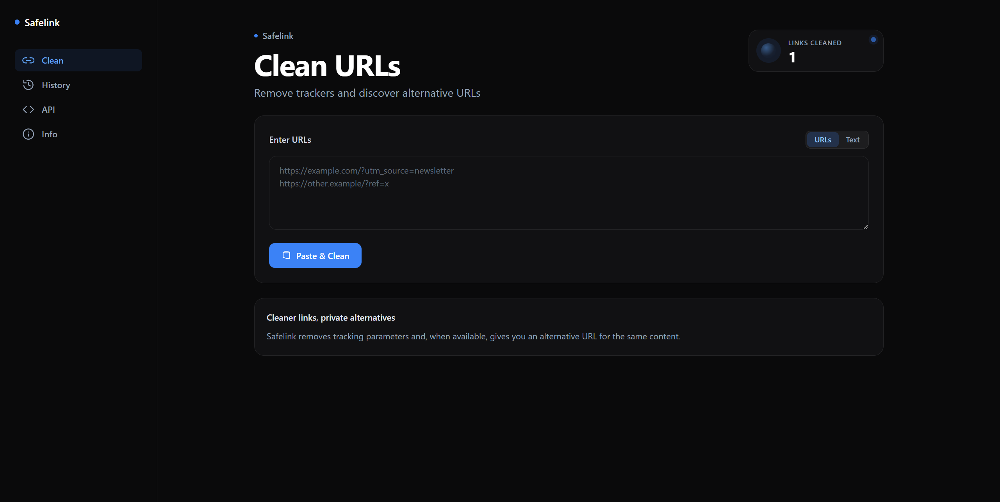

<p align="center">
  
</p>

<h1 align="center">Safelink</h1>

<p align="center">
  <strong>Privacy-first URL cleaner and alternative frontend resolver.</strong>
</p>

<p align="center">
  <a href="https://github.com/mouadlotfi/safelink/actions/workflows/ci.yml"></a>
  <a href="https://bun.sh"></a>
  <a href="https://nextjs.org"></a>
  <a href="https://fastapi.tiangolo.com"></a>
  <a href="https://docs.astral.sh/uv/"></a>
  <a href="LICENSE"></a>
</p>

---

<p align="center">
  
</p>

---

## Project overview

Safelink is a self-hostable privacy tool that strips tracking parameters from shared links and discovers active alternative frontends for popular websites.

---

## Key features

- **Tracker stripping.** Applies compiled ClearURLs rules alongside hardcoded pattern filters for TikTok, Facebook, Instagram, Spotify, and LinkedIn.
- **Short link expansion.** Follows redirects for short links (`vt.tiktok.com`, `fb.watch`, `lnkd.in`, and Reddit share links) and extracts canonical `<link>` tags.
- **Alternative frontends.** Queries LibRedirect instances, verifies availability via live HTTP HEAD probing, and prioritizes curated primary mirrors.
- **Batch and text modes.** Clean single links, multi-line URL lists, or paste full paragraphs of text to replace links in place without breaking punctuation.
- **Browser address-bar shortcuts.** Add Safelink Clean and Safelink Alt in Firefox, Chrome/Chromium, or Edge to clean a URL or open a privacy-friendly alternative directly.
- **Local history.** Keeps cleaned link history strictly in browser `localStorage` with quota safeguards and one-click JSON export. Nothing is logged on the server.
- **CORS-enabled REST API.** Exposes rate-limited `/api/clean`, `/api/alt`, and `/api/stats` endpoints for scripting and extension integration.

---

## Technology stack

| Layer | Technology | Version | Purpose |
| :--- | :--- | :--- | :--- |
| **Frontend Framework** | [Next.js](https://nextjs.org/) (App Router) | `16.2.11` | UI rendering, client state, and proxy route handlers |
| **UI Library** | [React](https://react.dev/) | `19.2.8` | Client-side reactive interface |
| **Styling** | [Tailwind CSS](https://tailwindcss.com/) | `3.4.19` | Responsive dark-mode styling |
| **Frontend Runtime** | [Bun](https://bun.sh/) | `1.3.6` | Package manager, bundler, and test runner |
| **Backend Framework** | [FastAPI](https://fastapi.tiangolo.com/) | `>= 0.115.0` | High-performance asynchronous REST API |
| **Backend Runtime** | [Python](https://python.org/) | `>= 3.11` (`3.12` in Docker) | URL parsing and processing engine |
| **Python Tooling** | [uv](https://docs.astral.sh/uv/) | Latest | Fast Python virtual environment and dependency manager |
| **HTTP Client** | [httpx](https://www.python-httpx.org/) | `>= 0.28.0` | Async HTTP client for redirects and instance probing |
| **Data Validation** | [Pydantic](https://docs.pydantic.dev/) | `>= 2.10.0` | Request and response schema enforcement |
| **Database** | [SQLite](https://sqlite.org/) | Python stdlib | Persistent site-wide sanitized links counter |
| **Containerization** | [Docker Compose](https://docs.docker.com/compose/) | v2 | Multi-stage image builds and deployment |

---

## Project architecture

Safelink separates client-side presentation from server-side URL operations. The Next.js frontend acts as a thin client; all URL expansion, rule compilation, and redirect probing run securely on the FastAPI backend.

```
Browser (React 19 / UI)
   │
   ▼
lib/api-client.ts (In-flight request deduplication)
   │
   ▼
Next.js routes (app/api/* and app/go/*)
   │  • Sliding-window rate limiting (IP / x-api-key)
   │  • URL format validation (HTTP/HTTPS, max 8192 chars)
   │
   ▼
lib/url-service.ts (Server-side fetch with 45s timeout)
   │
   ▼
FastAPI Backend (backend/app/main.py -> backend/app/routes/)
   │
   ▼
backend/app/lib/url_service.py (Pipeline Orchestrator)
   ├─► url_expander.py (Resolves redirects, canonical tags, yt-dlp fallback)
   ├─► clearurls.py (Applies ClearURLs rules + platform tracker patterns)
   ├─► custom_frontends.py (Static overrides: Imginn, Invidious, Nitter, Redlib)
   └─► alternative_frontends.py (LibRedirect data.json + live HTTP HEAD probing)
   │
   ▼
backend/app/lib/stats.py (Atomic SQLite counter in safelink_stats.sqlite3)
```

> [!NOTE]
> The browser never connects directly to the backend. Next.js API proxy routes (`/api/*`) validate parameters and enforce rate limits before routing calls to FastAPI.

---

## Project structure

```
.
├── app/                  # Next.js App Router (pages, layout, proxy route handlers)
│   ├── api/              # JSON proxy routes: /api/clean, /api/alt, /api/stats
│   ├── go/               # Browser address-bar redirect routes
│   ├── opensearch/       # Search-engine discovery descriptions
│   ├── api-docs/         # Interactive API documentation page
│   ├── history/          # Cleaned URLs local history page
│   └── info/             # Privacy & supported services documentation
├── components/           # React UI components (UrlProcessor, HistoryView, Navigation, Toast)
├── lib/                  # Frontend utilities (api-client, history, clipboard, url-extract)
├── backend/              # FastAPI Python backend service
│   ├── app/
│   │   ├── main.py       # FastAPI application entrypoint and shared httpx lifespan
│   │   ├── routes/       # Route handlers (/clean, /alt, /stats)
│   │   └── lib/          # Core URL processing engine (url_service, expander, clearurls, etc.)
│   └── tests/            # Pytest test suite (76 tests)
├── clearurls-rules.json  # Bundled ClearURLs ruleset fallback
├── data.json             # Bundled LibRedirect instances dataset fallback
├── docker-compose.yml    # Production compose (Coolify deployment with GHCR images)
├── docker-compose.dev.yml# Local dev compose (builds from source)
└── AGENTS.md             # Authoritative repository guidelines and architectural reference
```

---

## Getting started

### Option 1: Docker Compose (Recommended)

Run the full stack with a single command:

```bash
docker compose -f docker-compose.dev.yml up --build
```

- **Frontend:** [http://localhost:3000](http://localhost:3000)
- **Backend API:** [http://localhost:8000](http://localhost:8000)
- **API Documentation:** [http://localhost:3000/api-docs](http://localhost:3000/api-docs)

---

### Option 2: Manual local setup

#### Prerequisites
- [Bun](https://bun.sh) (`bun@1.3.6` or later)
- [Python](https://python.org) (version 3.11 or higher)
- [uv](https://docs.astral.sh/uv/)

#### 1. Backend Setup

```bash
cd backend
uv sync --extra dev
uv run uvicorn app.main:app --reload --port 8000
```

#### 2. Frontend Setup

In a separate terminal at the repository root:

```bash
echo 'SAFELINK_BACKEND_URL=http://localhost:8000' > .env.local
bun install
bun dev
```

Open [http://localhost:3000](http://localhost:3000) in your browser.

#### 3. Run both services together

After the setup above, you can start the backend and the frontend with one command instead of two terminals:

```bash
bun run dev:all
```

The script starts the backend on port 8000 and the frontend on port 3000, prints both URLs, and stops both when you press `Ctrl+C` or when either process exits. It checks that `node_modules` and the backend virtualenv exist, and prints the command to run if either is missing.

On Windows, use PowerShell instead:

```powershell
bun run dev:all:win
```

The scripts live in [scripts/dev.sh](scripts/dev.sh) (bash) and [scripts/dev.ps1](scripts/dev.ps1) (PowerShell).

---

## Add Safelink to your browser

Safelink provides two address-bar shortcuts. **Clean URL** removes tracking parameters. **Privacy-friendly alternative** opens an alternative frontend when one is available, or the cleaned original URL otherwise.

Use `https://safelink.mouadlotfi.com` for the hosted Safelink service. For a self-hosted or local deployment, replace the hostname with your own site address.

### Firefox

1. Visit your Safelink site. Firefox can discover the search engines from the OpenSearch descriptions linked in the page.
2. Open the search field's engine menu and choose **Add Search Engine** for **Safelink Clean** or **Safelink Alternative**. The exact control depends on your Firefox layout. You can also check **Settings → Search** after visiting the site.
3. Assign a keyword in **Settings → Search → Search Shortcuts**, such as `clean` or `alt`.
4. In the address bar, type the keyword, press Space, enter an HTTP or HTTPS URL, then press Enter.

### Chrome and other Chromium browsers

1. Open **Settings → Search engine → Manage search engines and site search**.
2. Under **Site search**, choose **Add**. Enter a name and shortcut, then use one of these URLs.

   | Name | Shortcut | URL |
   | --- | --- | --- |
   | Safelink Clean | `clean` | `https://safelink.mouadlotfi.com/go/clean?url=%s` |
   | Safelink Alternative | `alt` | `https://safelink.mouadlotfi.com/go/alt?url=%s` |

3. Save the site search. In the address bar, type its shortcut, press Space or Tab, enter an HTTP or HTTPS URL, then press Enter.

In Microsoft Edge, add the same URLs under **Settings → Privacy, search, and services → Address bar and search**. Menu names may vary slightly between Chromium browsers.

To test locally, use `http://localhost:3000/go/clean?url=%s` and `http://localhost:3000/go/alt?url=%s` as the URLs. Start both app services first with `bun run dev:all`.

---

## REST API reference

All API routes support both `GET` (query parameter) and `POST` (JSON body) requests, with open CORS (`Access-Control-Allow-Origin: *`).

### 1. Clean URL (`/api/clean`)

Strips tracking parameters and resolves short-link redirects.

```bash
curl -X POST http://localhost:3000/api/clean \
  -H "Content-Type: application/json" \
  -d '{"url": "https://open.spotify.com/track/4cOdK2wGLETKBW3PvgPWqT?si=abc&pi=123"}'
```

```json
{
  "original": "https://open.spotify.com/track/4cOdK2wGLETKBW3PvgPWqT?si=abc&pi=123",
  "cleaned": "https://open.spotify.com/track/4cOdK2wGLETKBW3PvgPWqT",
  "wasExpanded": false
}
```

---

### 2. Alternative frontend (`/api/alt`)

Cleans the URL and returns a verified alternative privacy frontend if available.

```bash
curl -X POST http://localhost:3000/api/alt \
  -H "Content-Type: application/json" \
  -d '{"url": "https://www.youtube.com/watch?v=dQw4w9WgXcQ"}'
```

```json
{
  "original": "https://www.youtube.com/watch?v=dQw4w9WgXcQ",
  "cleaned": "https://www.youtube.com/watch?v=dQw4w9WgXcQ",
  "service": "invidious",
  "alternative": "https://invidious.tiekoetter.com/watch?v=dQw4w9WgXcQ",
  "isCustomFrontend": true
}
```

---

### 3. Links cleaned stats (`/api/stats`)

Returns the count of sanitized links recorded by the SQLite backend.

```bash
curl http://localhost:3000/api/stats
```

```json
{
  "linksCleaned": 42
}
```

---

## Coding standards & conventions

### Frontend (Next.js / React)
- **Client Components:** Mark interactive stateful UI with `"use client"` at the top (`url-processor.tsx`, `history-view.tsx`, `toast.tsx`).
- **In-Flight Request Deduplication:** Use `withInflight(key, factory)` in `lib/api-client.ts` to prevent concurrent duplicate requests for the same URL.
- **History Encapsulation:** All browser storage access routes through `lib/history.ts` (`appendHistory`, `readHistory`, `clearHistory`). Components never touch `localStorage` directly.
- **Error Handling:** Gracefully catch alternative frontend errors so main URL cleaning always succeeds.

### Backend (FastAPI / Python)
- **Strictly Asynchronous:** All route handlers and engine modules are `async def`. Blocking operations use `asyncio.to_thread`.
- **Shared HTTP Client:** Use the singleton `get_http_client()` from `backend/app/lib/http_client.py` managed by FastAPI lifespan. Never instantiate ad-hoc clients per request.
- **Input Validation:** Enforce `validate_url` (HTTP/HTTPS, max 8192 characters, valid hostname) on all endpoints before processing.
- **Persistence:** SQLite counter persistence (`stats.py`) uses WAL mode, a 5000ms busy timeout, and `BEGIN IMMEDIATE` transactions.

---

## Testing

### Frontend test suite (Vitest)
```bash
bun run test          # Run Vitest test suite (37 tests)
bun run lint          # Run ESLint (ESLint 9 flat config)
bunx tsc --noEmit     # Typecheck TypeScript
```

### Backend test suite (Pytest)
```bash
cd backend
uv run pytest         # Run Pytest suite (76 tests)
uv run ruff check .   # Run Ruff linter
uv run ruff format .  # Run Ruff code formatter
```

---

## Development workflow & CI/CD

- **Branching Strategy:** Direct development on `main` with feature branches for larger additions.
- **Automated Pipeline (`.github/workflows/ci.yml`):**
  - **Pull Requests:** Runs backend tests (`pytest`, `ruff`), frontend checks (`vitest`, `eslint`, `tsc`), and a dry-run Docker build check.
  - **Pushes to `main`:** Runs tests, builds and tags multi-stage Docker images with the commit SHA, pushes to GitHub Container Registry (GHCR), authenticates via Tailscale Workload Identity Federation (WIF), and triggers automated deployment on Coolify.

---

## Environment variables

| Variable | Scope | Description | Default |
| :--- | :--- | :--- | :--- |
| `SAFELINK_BACKEND_URL` | Frontend | Target URL for the FastAPI backend service | `http://localhost:8000` |
| `NEXT_PUBLIC_WEBSITE_URL` | Frontend | Canonical site URL (used in API docs and metadata) | `http://localhost:3000` |
| `API_KEYS` | Frontend | Comma-separated list of valid `x-api-key` headers for elevated rate limits | `None` |
| `SAFELINK_STATS_DB` | Backend | Path to SQLite statistics database file | `backend/safelink_stats.sqlite3` |

---

## Contributing

Contributions are welcome. Please follow these guidelines:

1. Fork the repository and create a new feature branch.
2. Ensure all frontend checks (`bun run test`, `bun run lint`, `bunx tsc --noEmit`) and backend checks (`uv run pytest`, `uv run ruff check .`) pass.
3. Follow the established coding standards detailed in [AGENTS.md](AGENTS.md).
4. Submit a Pull Request with a clear summary of your changes.

---

## License

This project is licensed under the [GNU General Public License v3.0](LICENSE).
