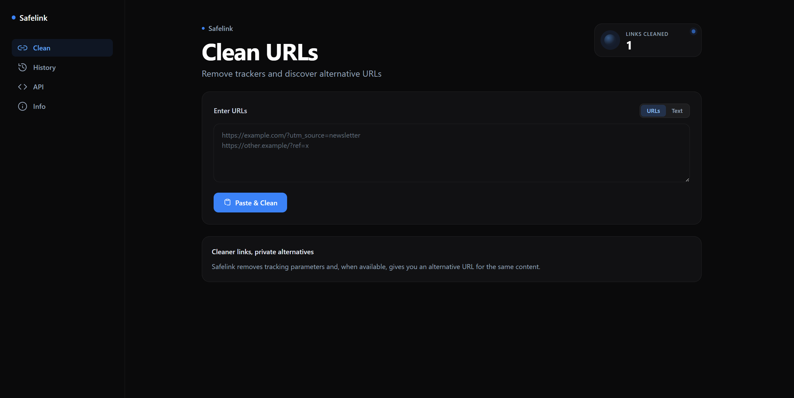

<p align="center">
  
</p>

<h1 align="center">Safelink</h1>

<p align="center">
  <strong>Strips tracking parameters from links and finds privacy-friendly frontends to open them in.</strong>
</p>

<p align="center">
  <a href="https://github.com/mouadlotfi/safelink/actions/workflows/ci.yml"></a>
  <a href="https://bun.sh"></a>
  <a href="https://nextjs.org"></a>
  <a href="https://fastapi.tiangolo.com"></a>
  <a href="https://docs.astral.sh/uv/"></a>
  <a href="LICENSE"></a>
</p>

---

<p align="center">
  
</p>

---

## What it does

Safelink takes a link full of tracking junk and gives you back a clean one. Paste in a video, post, or track URL and it removes the tracking parameters, follows the shortener if there is one, and can point you at a frontend that does not log what you read. You can run it yourself or use the hosted instance.

---

## Features

- Strips tracking parameters with ClearURLs rules plus hand-written filters for TikTok, Facebook, Instagram, Spotify, and LinkedIn.
- Follows short-link redirects (`vt.tiktok.com`, `fb.watch`, `lnkd.in`, and Reddit share links) and reads canonical `<link>` tags when that is faster.
- Finds working alternative frontends by querying LibRedirect instances, checking them with live HTTP HEAD requests, and preferring curated mirrors.
- Cleans a single link, a pasted list, or a whole paragraph, leaving the surrounding punctuation untouched.
- Runs from the address bar in Firefox, Chrome, Chromium, and Edge, so you do not have to open the app first.
- Keeps history in browser `localStorage` with a quota safeguard and JSON export. The server logs nothing.
- Exposes a rate-limited REST API at `/api/clean`, `/api/alt`, and `/api/stats` for scripts and extensions.

---

## Stack

| Layer | Technology | Version | Purpose |
| :--- | :--- | :--- | :--- |
| Frontend framework | [Next.js](https://nextjs.org/) (App Router) | `16.2.11` | UI, client state, and proxy routes |
| UI library | [React](https://react.dev/) | `19.2.8` | Client-side UI |
| Styling | [Tailwind CSS](https://tailwindcss.com/) | `3.4.19` | Dark-mode styling |
| Frontend runtime | [Bun](https://bun.sh/) | `1.3.6` | Package manager, bundler, test runner |
| Backend framework | [FastAPI](https://fastapi.tiangolo.com/) | `>= 0.115.0` | Async REST API |
| Backend runtime | [Python](https://python.org/) | `>= 3.11` (`3.12` in Docker) | URL parsing and processing |
| Python tooling | [uv](https://docs.astral.sh/uv/) | Latest | Virtualenv and dependency manager |
| HTTP client | [httpx](https://www.python-httpx.org/) | `>= 0.28.0` | Async requests for redirects and instance probing |
| Data validation | [Pydantic](https://docs.pydantic.dev/) | `>= 2.10.0` | Request and response schemas |
| Database | [SQLite](https://sqlite.org/) | Python stdlib | Counts cleaned links |
| Containers | [Docker Compose](https://docs.docker.com/compose/) | v2 | Builds images and runs the stack |

---

## How it works

All URL work happens in the FastAPI backend. The Next.js frontend only renders the UI and proxies requests, so the browser never talks to the backend directly.

```
Browser (React 19 / UI)
   │
   ▼
lib/api-client.ts (In-flight request deduplication)
   │
   ▼
Next.js routes (app/api/* and app/go/*)
   │  • Sliding-window rate limiting (IP / x-api-key)
   │  • URL format validation (HTTP/HTTPS, max 8192 chars)
   │
   ▼
lib/url-service.ts (Server-side fetch with 45s timeout)
   │
   ▼
FastAPI Backend (backend/app/main.py -> backend/app/routes/)
   │
   ▼
backend/app/lib/url_service.py (Pipeline orchestrator)
   ├─► url_expander.py (Resolves redirects, canonical tags, yt-dlp fallback)
   ├─► clearurls.py (Applies ClearURLs rules + platform tracker patterns)
   ├─► custom_frontends.py (Static overrides: Imginn, Invidious, Nitter, Redlib)
   └─► alternative_frontends.py (LibRedirect data.json + live HTTP HEAD probing)
   │
   ▼
backend/app/lib/stats.py (Atomic SQLite counter in safelink_stats.sqlite3)
```

> [!NOTE]
> The browser never connects to the backend. Next.js proxy routes (`/api/*`) validate parameters and enforce rate limits before forwarding to FastAPI.

---

## Project structure

```
.
├── app/                  # Next.js App Router (pages, layout, proxy route handlers)
│   ├── api/              # JSON proxy routes: /api/clean, /api/alt, /api/stats
│   ├── go/               # Browser address-bar redirect routes
│   ├── opensearch/       # Search-engine discovery descriptions
│   ├── api-docs/         # Interactive API documentation page
│   ├── history/          # Cleaned URLs local history page
│   └── info/             # Privacy & supported services documentation
├── components/           # React UI components (UrlProcessor, HistoryView, Navigation, Toast)
├── lib/                  # Frontend utilities (api-client, history, clipboard, url-extract)
├── backend/              # FastAPI Python backend service
│   ├── app/
│   │   ├── main.py       # FastAPI application entrypoint and shared httpx lifespan
│   │   ├── routes/       # Route handlers (/clean, /alt, /stats)
│   │   └── lib/          # URL processing engine (url_service, expander, clearurls, etc.)
│   └── tests/            # Pytest test suite (76 tests)
├── clearurls-rules.json  # Bundled ClearURLs ruleset fallback
├── data.json             # Bundled LibRedirect instances dataset fallback
├── docker-compose.yml    # Production compose (Coolify deployment with GHCR images)
├── docker-compose.dev.yml# Local dev compose (builds from source)
└── AGENTS.md             # Repository guidelines and architectural reference
```

---

## Running it locally

### Option 1: Docker Compose (recommended)

Start the whole stack:

```bash
docker compose -f docker-compose.dev.yml up --build
```

- Frontend: [http://localhost:3000](http://localhost:3000)
- Backend API: [http://localhost:8000](http://localhost:8000)
- API docs: [http://localhost:3000/api-docs](http://localhost:3000/api-docs)

---

### Option 2: Manual setup

#### Prerequisites
- [Bun](https://bun.sh) (`bun@1.3.6` or later)
- [Python](https://python.org) (version 3.11 or higher)
- [uv](https://docs.astral.sh/uv/)

#### Backend

```bash
cd backend
uv sync --extra dev
uv run uvicorn app.main:app --reload --port 8000
```

#### Frontend

In a separate terminal at the repository root:

```bash
echo 'SAFELINK_BACKEND_URL=http://localhost:8000' > .env.local
bun install
bun dev
```

Open [http://localhost:3000](http://localhost:3000) in your browser.

#### Both at once

After the setup above, one command starts the backend on port 8000 and the frontend on port 3000, prints both URLs, and stops both on `Ctrl+C` or when either process exits:

```bash
bun run dev:all
```

It checks that `node_modules` and the backend virtualenv exist, and prints the command to create whichever is missing.

On Windows, use PowerShell instead:

```powershell
bun run dev:all:win
```

The scripts live in [scripts/dev.sh](scripts/dev.sh) (bash) and [scripts/dev.ps1](scripts/dev.ps1) (PowerShell).

---

## Add Safelink to your browser

Safelink ships two address-bar shortcuts. **Clean URL** removes tracking parameters. **Privacy-friendly alternative** opens an alternative frontend when one exists, or the cleaned original URL when none does.

Use `https://safelink.mouadlotfi.com` for the hosted instance. For a self-hosted or local deployment, replace the hostname with your own.

### Firefox

1. Visit your Safelink site. Firefox discovers the search engines from the OpenSearch descriptions linked in the page.
2. Open the search field's engine menu and choose **Add Search Engine** for **Safelink Clean** or **Safelink Alternative**. The exact control depends on your Firefox layout, and you can also check **Settings → Search** after visiting the site.
3. Assign a keyword in **Settings → Search → Search Shortcuts**, such as `clean` or `alt`.
4. In the address bar, type the keyword, press Space, enter an HTTP or HTTPS URL, then press Enter.

### Chrome and other Chromium browsers

1. Open **Settings → Search engine → Manage search engines and site search**.
2. Under **Site search**, choose **Add**. Enter a name and shortcut, then use one of these URLs.

   | Name | Shortcut | URL |
   | --- | --- | --- |
   | Safelink Clean | `clean` | `https://safelink.mouadlotfi.com/go/clean?url=%s` |
   | Safelink Alternative | `alt` | `https://safelink.mouadlotfi.com/go/alt?url=%s` |

3. Save the site search. In the address bar, type its shortcut, press Space or Tab, enter an HTTP or HTTPS URL, then press Enter.

In Microsoft Edge, add the same URLs under **Settings → Privacy, search, and services → Address bar and search**. Menu names vary slightly between Chromium browsers.

To test locally, use `http://localhost:3000/go/clean?url=%s` and `http://localhost:3000/go/alt?url=%s`. Start both services first with `bun run dev:all`.

---

## REST API reference

Every route accepts `GET` (query parameter) and `POST` (JSON body), with open CORS (`Access-Control-Allow-Origin: *`).

### 1. Clean URL (`/api/clean`)

Strips tracking parameters and resolves short-link redirects.

```bash
curl -X POST http://localhost:3000/api/clean \
  -H "Content-Type: application/json" \
  -d '{"url": "https://open.spotify.com/track/4cOdK2wGLETKBW3PvgPWqT?si=abc&pi=123"}'
```

```json
{
  "original": "https://open.spotify.com/track/4cOdK2wGLETKBW3PvgPWqT?si=abc&pi=123",
  "cleaned": "https://open.spotify.com/track/4cOdK2wGLETKBW3PvgPWqT",
  "wasExpanded": false
}
```

---

### 2. Alternative frontend (`/api/alt`)

Cleans the URL and returns a verified alternative frontend if one is reachable.

```bash
curl -X POST http://localhost:3000/api/alt \
  -H "Content-Type: application/json" \
  -d '{"url": "https://www.youtube.com/watch?v=dQw4w9WgXcQ"}'
```

```json
{
  "original": "https://www.youtube.com/watch?v=dQw4w9WgXcQ",
  "cleaned": "https://www.youtube.com/watch?v=dQw4w9WgXcQ",
  "service": "invidious",
  "alternative": "https://invidious.tiekoetter.com/watch?v=dQw4w9WgXcQ",
  "isCustomFrontend": true
}
```

---

### 3. Links cleaned stats (`/api/stats`)

Returns the number of cleaned links recorded by the SQLite backend.

```bash
curl http://localhost:3000/api/stats
```

```json
{
  "linksCleaned": 42
}
```

---

## Code conventions

### Frontend (Next.js / React)

- Interactive UI files start with `"use client"` (`url-processor.tsx`, `history-view.tsx`, `toast.tsx`).
- Wrap fetches in `withInflight(key, factory)` from `lib/api-client.ts` so concurrent requests for the same URL collapse into one.
- Read and write browser storage through `lib/history.ts` (`appendHistory`, `readHistory`, `clearHistory`). Components never touch `localStorage` directly.
- Catch alternative-frontend errors so URL cleaning still succeeds.

### Backend (FastAPI / Python)

- Route handlers and engine modules are all `async def`. Blocking calls go through `asyncio.to_thread`.
- Get the shared client from `get_http_client()` in `backend/app/lib/http_client.py`. Do not create clients per request.
- Run `validate_url` (HTTP/HTTPS, max 8192 characters, valid hostname) before processing any endpoint.
- Stats persistence uses WAL mode, a 5000ms busy timeout, and `BEGIN IMMEDIATE` transactions.

---

## Testing

### Frontend (Vitest)

```bash
bun run test          # Vitest suite (37 tests)
bun run lint          # ESLint 9 flat config
bunx tsc --noEmit     # Typecheck TypeScript
```

### Backend (Pytest)

```bash
cd backend
uv run pytest         # Pytest suite (76 tests)
uv run ruff check .   # Ruff linter
uv run ruff format .  # Ruff formatter
```

---

## CI/CD

Work lands directly on `main`; larger features get a branch. `.github/workflows/ci.yml` does the rest:

- On pull requests: backend tests (`pytest`, `ruff`), frontend checks (`vitest`, `eslint`, `tsc`), and a dry-run Docker build.
- On pushes to `main`: the same tests, then CI builds multi-stage Docker images tagged with the commit SHA and pushes them to GHCR. It authenticates through Tailscale Workload Identity Federation and triggers a Coolify deployment.

---

## Environment variables

| Variable | Scope | Description | Default |
| :--- | :--- | :--- | :--- |
| `SAFELINK_BACKEND_URL` | Frontend | URL of the FastAPI backend service | `http://localhost:8000` |
| `NEXT_PUBLIC_WEBSITE_URL` | Frontend | Canonical site URL, used in API docs and metadata | `http://localhost:3000` |
| `API_KEYS` | Frontend | Comma-separated `x-api-key` values that get elevated rate limits | `None` |
| `SAFELINK_STATS_DB` | Backend | Path to the SQLite statistics database | `backend/safelink_stats.sqlite3` |

---

## Contributing

1. Fork the repository and create a feature branch.
2. Make sure the frontend checks (`bun run test`, `bun run lint`, `bunx tsc --noEmit`) and backend checks (`uv run pytest`, `uv run ruff check .`) pass.
3. Follow the conventions in [AGENTS.md](AGENTS.md).
4. Open a pull request with a clear summary.

---

## License

GNU General Public License v3.0. See [LICENSE](LICENSE).
